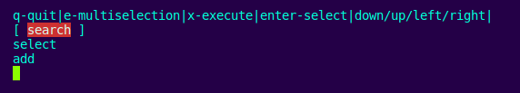
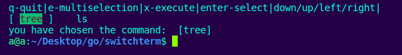
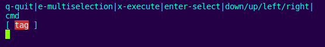

# Switchterm

 


  - [switchterm](#switchterm)
  - [General info](#general-info)
  - [Why build this?](#why-build-this)
  - [What does it do?](#what-does-it-do)
  - [Technologies](#technologies)
  - [Requirements](#requirements)
  - [Repository overview](#repository-overview)
  - [Overview of the code.](#Overview-of-the-code.)
  - [Things to remember](#things-to-remember)
  - [Reference Commands](#reference-commands)
  - [Special thanks](#special-thanks)


## General info
This project is a command line selection tool.
It stores commands in a sqlite database and their tags


## Why build this?
* Go never changes
* Wanted a easy quick way to run commands and search for them.


## What does it do?
* lets you select multiple commands and run them

 <h1 align="center"> Main menu for selection</h1>
 <p align="center">


</p>
<h1 align="center">Selection menu that is formatted</h1>
 <p align="center">

</p>
<h1 align="center">You can even do search by tag</h1>
 <p align="center">

</p>

## Technologies
Project is created with:
* [atomicgo.dev/keyboard](https://atomicgo.dev/keyboard) - For pressing keys
* [https://pkg.go.dev/modernc.org/sqlite](https://pkg.go.dev/modernc.org/sqlite) - Basically for keeping state


## Requirements
* go 1.21 for gonew

## How to run as is?
*1. install the library
```bash
go get github.com/golangast/switchterm
```
*2. do mod tidy/vendor
```bash
go mod tidy && go mod vendor
```
*3. run the program
```bash
go run .
```


*1. install gonew to pull down project quickly
```bash
go install golang.org/x/tools/cmd/gonew@latest
```
*2. run gonew
```bash
gonew github.com/golangast/switchterm example.com/switchterm
```

## Repository overview
```bash
├── db [folder db functions]
├── configure [folder for config utility functions]
├── switchtermer [folder for functions]
│   ├── colortermer [file for coloring selections]
│   ├── switchutility [file for selection functions]
│   └── switchtermer.go [where the service functions are]

```
## Overview of the code.
1. allows for the user to select one from multiple values 
```bash
answer := DigSingle(lists, 1, "green", "red")
```
2. allows for the user to select many from multiple values
```bash
answer := Dig(lists, 1, "green", "red")
```
3. prints the selection and formats it.
```bash
switchutility.PrintColumnsWChosen(cols, atline, results, background, foreground)
```
4. allows you to ask a question and save the value
```bash
       fmt.Println("add a commnd..")
		scanner := bufio.NewScanner(os.Stdin)
		scanner.Scan()
		inputcmd := scanner.Text()
```
5. prints the directions and clears the terminal
```bash
 	switchutility.ClearDirections()
```
6. allows you to start the keyboard key press selecting
```bash
         err := keyboard.Listen(func(key keys.Key) (stop bool, err error) {
		switch key.String() {
```


## Things to remember
* using atomicgo.dev/keyboard there is no way to call itself after a key press

## Reference Commands
* "enter" is to select
* "e" is to select many
* "r" is to remove
* "x" is to execute
* "q" is to quit

## Licenses
1. [GNU 3 for my code](https://github.com/golangast/switchterm/blob/main/LICENSE.md)
2. [MIT License for atomicgo keyboard](https://github.com/atomicgo/keyboard/blob/main/LICENSE)
3. [BSD-3-Clause for sqlite driver](https://pkg.go.dev/modernc.org/sqlite?tab=licenses) 
4. [BSD-3-Clause for Go itself](https://github.com/golang/go/blob/master/LICENSE) 

## Special thanks
* [Go Team because they are gods](https://github.com/golang/go/graphs/contributors)
* [Creators of https://pkg.go.dev/modernc.org/sqlite - ](https://gitlab.com/cznic/sqlite/-/project_members)
