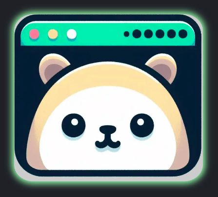
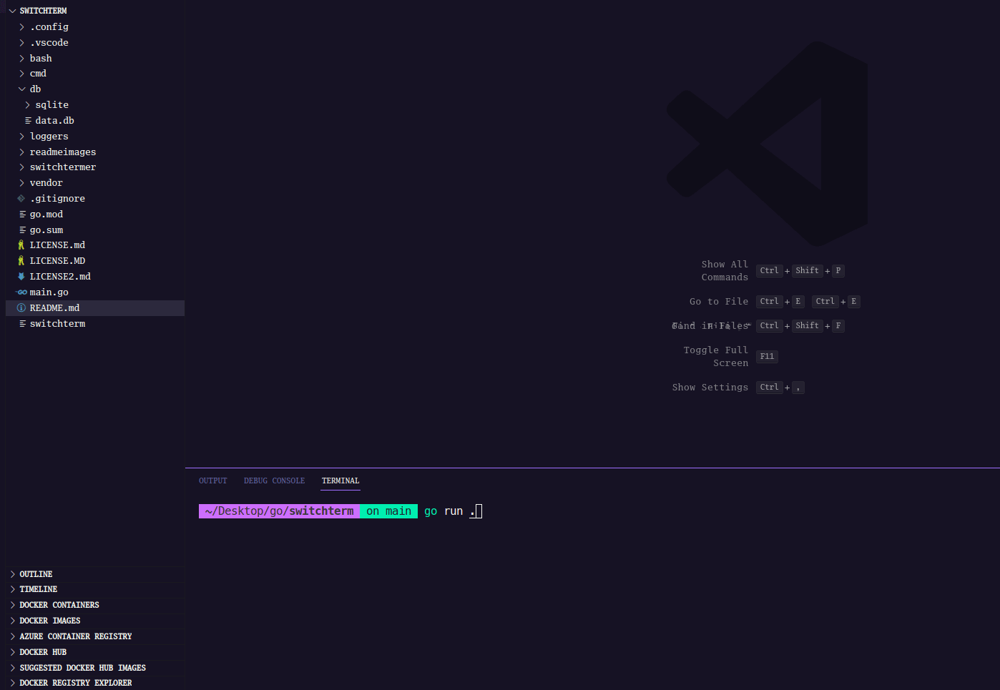
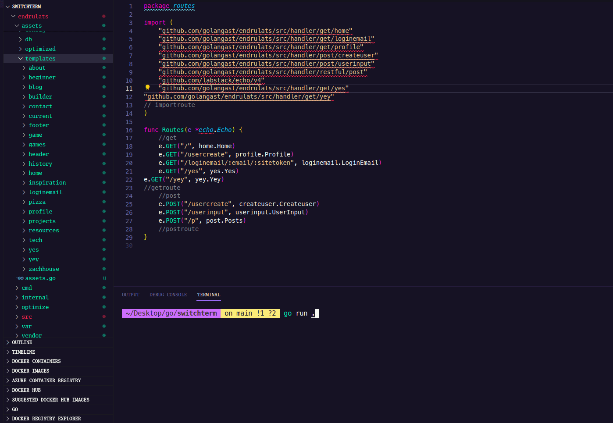
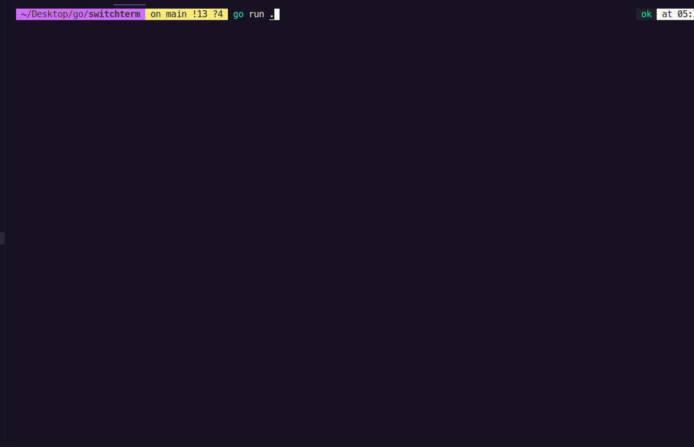

# switchterm

<p align="center">

</p>


 


[](http://endrulats.com)[](http://makeapullrequest.com)[](https://GitHub.com/Naereen/StrapDown.js/graphs/commit-activity)[](https://github.com/golangast/switchterm)[](https://pkg.go.dev/github.com/golangast/switchterm/switchtermer)[](https://goreportcard.com/report/github.com/golangast/switchterm)[](https://saythanks.io/to/kennethreitz)


  - [switchterm](#switchterm)
  - [General info](#general-info)
  - [Why build this?](#why-build-this)
  - [What does it do?](#what-does-it-do)
  - [Technologies](#technologies)
  - [Requirements](#requirements)
  - [Repository overview](#repository-overview)
  - [Overview of the code.](#Overview-of-the-code.)
  - [Things to remember](#things-to-remember)
  - [Reference Commands](#reference-commands)
  - [Special thanks](#special-thanks)
  - [Why Go?](#why-go)


## General info
This project is a command line selection tool. 
It stores commands in a sqlite database and their tags


## Why build this?
* Go never changes
* Wanted a easy quick way to run commands and search for them.


## What does it do?
* Made a multi-part series on it 
* [original](https://youtu.be/HJHCndEVoiA?si=dTewGeY4TlGSKo4_)
* [part1](https://www.youtube.com/watch?v=Qgs7-FZaT9Q)
* [part2](https://www.youtube.com/watch?v=y1w1y3m6I9k)
* 439 directories, 4037 files

<h1 align="center">Change the directory of the commands and run them</h1>
 <p align="center">

</p>
<h1 align="center">You can even do search by tag</h1>
 <p align="center">

<h1 align="center">Run multiple commands</h1>
 <p align="center">

</p>
<h1 align="center">Make bash files and run arguments in them</h1>
 <p align="center">

</p>
<h1 align="center">Generate your server</h1>
 <p align="center">

</p>
<h1 align="center">Generate your get handlers</h1>
 <p align="center">

</p>
<h1 align="center">Generate your data and choose the Handler you want it to be connected to</h1>
 <p align="center">

</p>

## Technologies
Project is created with:
* [atomicgo.dev/keyboard](https://atomicgo.dev/keyboard) - For pressing keys
* [github.com/Masterminds/sprig](github.com/Masterminds/sprig) - For template functions
* [https://pkg.go.dev/modernc.org/sqlite](https://pkg.go.dev/modernc.org/sqlite) - Basically for keeping state


## Requirements
* go 1.21 for gonew

## How to run as is?


*- clone it
```bash
git clone https://github.com/golangast/switchterm
```
* - or
* - install gonew to pull down project quickly
```bash
go install golang.org/x/tools/cmd/gonew@latest
```
* - run gonew
```bash
gonew github.com/golangast/switchterm example.com/switchterm
```

* - cd into switchterm
```bash
cd switchterm
```

* - run the project
```bash
go run main.go
```

## Repository overview
```bash
├── bash #where bash commands are generated
├── cmd  #where cmd commands are generated
├── db   #database for switchterm
├── loggers #loggers for switchterm
├── readmeimages #readmeimages for switchterm readme
├── switchtermer 
│   ├── cmd  #how cmd commands are generated
│   ├── data #data for switchterm (under construction)
│   ├── db   #database for switchterm
│   ├── generate  #generate switchterm
│   ├── settings  #settings for switchterm
│   ├── switch    #main switch fuctions
│   └── window    #window for switch

```

## Overview of the code.
1. allows for the user to select one from multiple values 
```bash
answer := DigSingle(lists, 1, "green", "red")
```
2. allows for the user to select many from multiple values
```bash
answer := Dig(lists, 1, "green", "red")
```
3. prints the selection and formats it.
```bash
switchutility.PrintColumnsWChosen(cols, atline, results, background, foreground)
```
4. allows you to ask a question and save the value
```bash
       fmt.Println("add a commnd..")
		scanner := bufio.NewScanner(os.Stdin)
		scanner.Scan()
		inputcmd := scanner.Text()
```
5. prints the directions and clears the terminal
```bash
 	switchutility.ClearDirections()
```
6. allows you to start the keyboard key press selecting
```bash
         err := keyboard.Listen(func(key keys.Key) (stop bool, err error) {
		switch key.String() {
```

## Things to remember
* using atomicgo.dev/keyboard there is no way to call itself after a key press

## Reference Commands
* "enter" is to select
* "c" is to select many
* "r" is to remove
* "x" is to execute
* "q" is to quit

## Licenses
1. [GNU 3 for my code](https://github.com/golangast/switchterm/blob/main/LICENSE.md)
2. [MIT License for atomicgo keyboard](https://github.com/atomicgo/keyboard/blob/main/LICENSE)
2. [MIT License for sprig](https://github.com/Masterminds/sprig?tab=MIT-1-ov-file#readme)
3. [BSD-3-Clause for sqlite driver](https://pkg.go.dev/modernc.org/sqlite?tab=licenses) 
4. [BSD-3-Clause for Go itself](https://github.com/golang/go/blob/master/LICENSE) 

## Special thanks
* [Go Team because they are gods](https://github.com/golang/go/graphs/contributors)
* [Creators of https://pkg.go.dev/modernc.org/sqlite - ](https://gitlab.com/cznic/sqlite/-/project_members)
* [Creators of https://github.com/Masterminds/sprig- ](https://github.com/Masterminds/sprig/graphs/contributors)
* [Creators of https://github.com/atomicgo/keyboard - ](https://github.com/MarvinJWendt)

## Why Go?
* The language is done since 1.0.https://youtu.be/rFejpH_tAHM there are little features that get added after 10 years but whatever you learn now will forever be useful.
* It also has a compatibility promise https://go.dev/doc/go1compat
* It was also built by great people. https://hackernoon.com/why-go-ef8850dc5f3c
* 14th used language https://insights.stackoverflow.com/survey/2021
* Highest starred language https://github.com/golang/go
* It is also number 1 language to go to and not from https://www.jetbrains.com/lp/devecosystem-2021/#Do-you-plan-to-adopt--migrate-to-other-languages-in-the-next--months-If-so-to-which-ones
* Go is growing in all measures https://madnight.github.io/githut/#/stars/2023/3
* Jobs are almost doubling every year. https://stacktrends.dev/technologies/programming-languages/golang/
* Companies that use go. https://go.dev/wiki/GoUsers
* Why I picked Go https://youtu.be/fD005g07cU4
